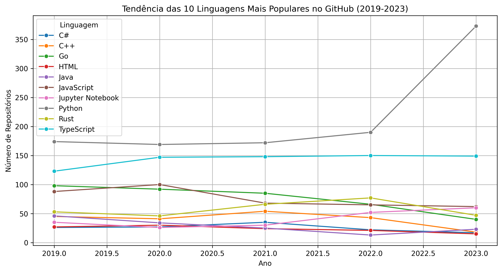

# 📊 Análise das linguagens mais utilizadas dentro do período de 2019-2023 no GitHub

Este repositório contém um projeto de análise de dados que utiliza a API do GitHub para coletar informações sobre as linguagens mais utilizadas em repositórios nos últimos anos.

## Objetivos do projeto:
- **Coleta de Dados**: 
    - Coletar dados de repositórios do GitHub usando a API do GitHub.
    - Armazenar os dados em um formato estruturado para análise.
    - Entender a evolução das linguagens de programação no GitHub e visualizar essas tendências.

- **Limpeza de Dados**:
    - Processar os dados brutos para remover inconsistências e informações irrelevantes.
    - Normalizar os dados para facilitar a análise.

- **Análise Preliminar**:
    - Identificar as principais linguagens de programação utilizadas nos repositórios do GitHub.
    - Gerar visualizações iniciais para representar a distribuição das linguagens.

## 🚀 Tecnologias Usadas
- Python
- Requests
- Pandas
- Matplotlib
- Seaborn

---

## 📂 Estrutura do Projeto

```
/github-language-analysis
├── language_trends.csv           # Arquivo com os dados processados
│    
├── github_data.py                # Coleta dados da API do GitHub e processa os dados brutos     
├── analyze_data.py               # Gera visualizações e análises     
├── analyze_data.ipynb            # Gera visualizações e análises em formato jupyter notebook            
│
├── .gitignore                    # Arquivos ignorados no versionamento
├── requirements.txt              # Lista de dependências do projeto
├── README.md                     # Documentação do projeto
└── .env                          # Arquivo com variáveis de ambiente (Não incluído no Git)
```

---

## 🛠️ Configuração do Ambiente

### 🔹 1. Clonar o repositório

```bash
git clone https://github.com/seu-usuario/github-language-analysis.git
cd github-language-analysis
```

### 🔹 2. Criar e ativar um ambiente virtual (opcional, mas recomendado)

```bash
python3 -m venv venv
source venv/bin/activate  # Linux/macOS
venv\Scripts\activate     # Windows
```

### 🔹 3. Instalar as dependências

```bash
pip install -r requirements.txt
```

### 🔹 4. Configurar a API do GitHub

Para acessar a API do GitHub, é necessário um token de autenticação. Siga os passos:

1. Gere um **Personal Access Token** no GitHub ([instruções aqui](https://github.com/settings/tokens)).
2. Crie um arquivo `.env` no diretório raiz do projeto e adicione:
   ```env
   GITHUB_TOKEN=seu_token_aqui
   ```

---

## 🚀 Execução do Projeto

### 🔹 1. Coletar dados da API do GitHub

```bash
python github_data.py
```

Esse script faz requisições à API do GitHub para obter informações sobre os repositórios e salva os dados coletados.

### 🔹 2. Processar e analisar os dados coletados, além de gerar as visualizações em gráfico

```bash
python analyze_data.py
```

Esse script limpa, transforma e organiza os dados em um formato adequado para análise, além de gerar gráficos para visualizar as tendências das linguagens mais populares

---

## 📊 Exemplo de Visualização

O script `analyze_data.py` gera um gráfico que mostra a evolução das 10 linguagens mais populares no GitHub de 2019 a 2023. O gráfico é salvo automaticamente como `language_trends_plot.png` no diretório raiz do projeto.



---

## 🤝 Contribuição

Se quiser contribuir com melhorias, siga estes passos:

1. Faça um **fork** do repositório.
2. Crie uma nova **branch**: `git checkout -b minha-mudanca`.
3. Faça suas alterações e envie o commit: `git commit -m "Melhoria na análise de dados"`.
4. Envie suas mudanças: `git push origin minha-mudanca`.
5. Abra um **Pull Request** para revisão.

---

## 📧 Contato

👤 **Pedro Steinmüller**
- 📍 Campina Grande, PB
- 💼 [LinkedIn](https://www.linkedin.com/in/pedro-steinmuller/)
- 📂 [Portfólio no GitHub](https://github.com/PedroSteinmuller)

Se gostou do projeto, deixe uma ⭐ no repositório! 🚀